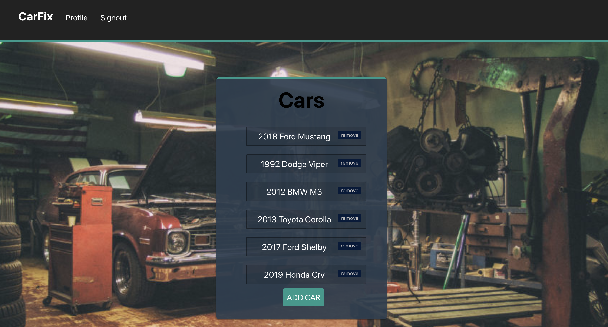
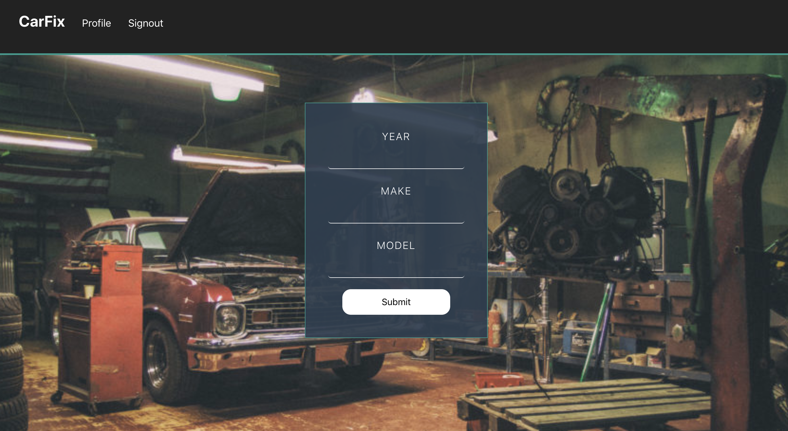
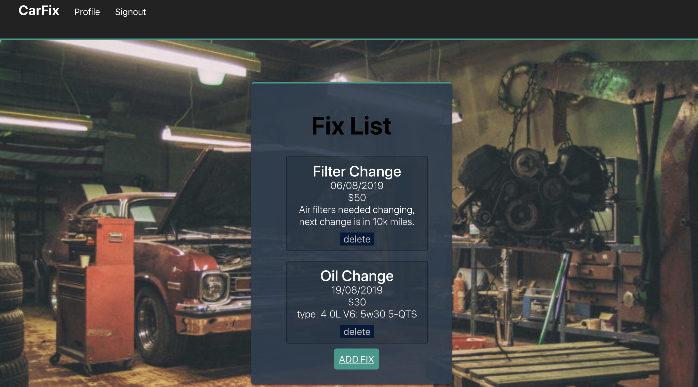

# AutoFix

<h2>DESCRIPTION</h2> 
AutoFix is a web application that is intended for mechanics to keep a log of all of their client's cars. Aswell the auto repairs that belong to each car. AutoFix is also useful for those car enthusiasts who love to keep track of the maintenance of their car.

<h2>FUNCTIONALITY</h2>

This app's functionality includes:

<ul>
	<li>Access to demo accounts to try the app out before signing up</li>
	<li>Register as a user</li>
	<li>Login as an exciting user</li>
	<li>Ability to register car</li>
  <li>Ability to adding auto repairs that belong to each car</li>
	<li>Ability to delete cars and fixs</li>
</ul>

<H2>APPLICATION WEBSITE</h2>

 
May preview a working prototype at <a href="https://auto-fix.herokuapp.com">AutoFix</a>

### Landing Page

### About Page

### User Login

### User Registration Page

### User's Profile Page

### Car Form

### Repair Page

### Repair Form

<h2>Password Requirements</h2>
<ul>
	<li>Minimum 6 characters</li>
	<li>Maximum 72 characters</li>
</ul>

<h2>SECURITY</h2>
<ul>
	<li>Application uses JWT authentication </li>
	<li>Passwords are encrypted using bcrypt.js</li>
</ul>

<h2>TECHNOLOGY</h2>
<h3>Front End</h3>
<ul>
	<li>HTML</li>
	<li>CSS</li>
	<li>JavaScript</li>
	<li>AJAX JSON calls to the app's API</li>
  <li>React</li>
  <li>Context Library</li>
</ul>

<h3>Back End</h3>
<ul>
	<li>Node.js</li>
	<li>Express</li>
	<li>Mocha</li>
	<li>Chai</li>
	<li>MongoDB</li>
	<li>Mongoose</li>
	<li>bcryptjs</li>
	<li>Passport</li>
</ul>

<h2>API Documentation</h2>

Repo for back end <a href="https://github.com/CarlosDeO/AutoFix-Backend">AutoFix-backend</a>

API endpoints for the back end include:

<ul>Users
	<li>POST to '/api/auth' to create a new users</li>
	<li>POST to '/api/users' sign in exciting user</li>
</ul>

<ul>Cars
	<li>GET to '/api/cars' to view all existing cars that are registered</li>
	<li>GET to '/api/cars/:id' to view a single car by ID</li>
	<li>POST to '/api/cars' to register new car entry</li>
	<li>PUT to '/api/cars/:id' to edit an exciting car entry by ID</li>
  <li>DELETE to '/api/cars/:id' to delete a single car by ID</li>
</ul>

<ul>Fixs
	<li>GET to '/api/fixs/:carid' to view all fixes existing to a single car </li>
	<li>POST to '/api/fix' to add new fix entry</li>
	<li>PUT to '/api/fixs/:id' to edit an exciting fix entry by ID</li>
  <li>DELETE to '/api/fixs/:id' to delete a single fix by ID</li>
</ul>

